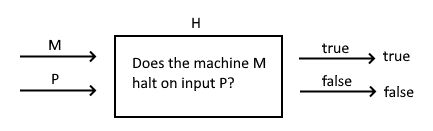
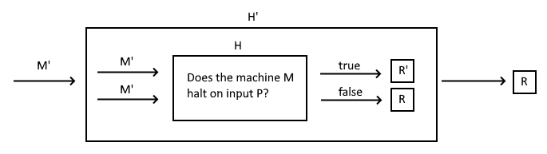

# Halt problem
## Problem

TL;DR 

https://www.youtube.com/watch?v=macM_MtS_w4

## Description

Can we create a machine H, in which it can determine a given machine M and a given input I that will halt or not. It is also the proof of whether a turing machine can solve all the problems or not.

For example, if (the machine M with input I) will halt, then H will return true. Similarily, if (the machine M with input I') will not half, then H will return false.

*Machine H  (image 1)*

## Prove by contradtion

Assume H does exist, by extending H, a new machine H' can be created, called H'.

*Machine H' (image 2), where R means a machine always halt and R' is the reverse*

### Case 1: if H' halts, then ...

By substituding H' into H in image 1, then H returns true, hence H(H', H') is true.

By substituding H' into H' itself in image 2, then H returns R, hence H(H', H') is false.

Thus, contradiction.

### Case 2: if H' does not halt, then ...

By substituding H' into H, then H returns false, hence H(H', H') is false.

By substituding H' into H' itself, then H returns R', hence H(H', H') is true.

Thus, contradiction.

### Conclusion

Since both cases are contradicting to the assumption, H does not exist.